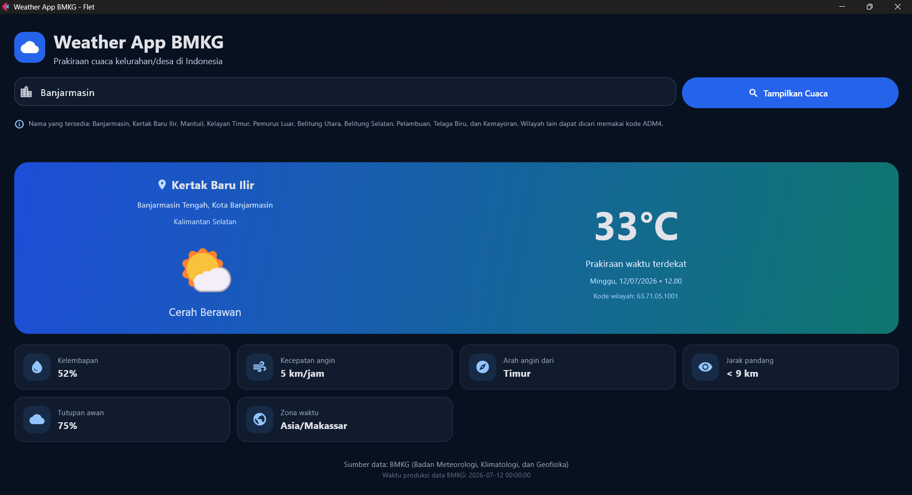

# Weather App BMKG

Weather App BMKG adalah aplikasi desktop sederhana berbasis **Python** dan **Flet** untuk menampilkan informasi cuaca wilayah Indonesia menggunakan data dari **API BMKG**.

Proyek ini dibuat sebagai proyek latihan pemula untuk mempelajari pembuatan antarmuka aplikasi, penggunaan REST API, pengolahan data JSON, function, validasi input, dan penanganan error.

## Tampilan Aplikasi



## Fitur Utama

- Mencari cuaca menggunakan nama wilayah yang tersedia.
- Mendukung pencarian menggunakan kode wilayah ADM4.
- Menampilkan kondisi dan ikon cuaca.
- Menampilkan suhu udara.
- Menampilkan kelembapan.
- Menampilkan kecepatan dan arah angin.
- Menampilkan jarak pandang.
- Menampilkan tutupan awan dan zona waktu.
- Menangani lokasi yang tidak ditemukan.
- Menangani gangguan koneksi atau kegagalan API.

## Teknologi yang Digunakan

- **Python** — bahasa pemrograman utama.
- **Flet** — membuat antarmuka aplikasi desktop.
- **Requests** — mengirim permintaan HTTP ke API BMKG.
- **REST API** — menghubungkan aplikasi dengan layanan data cuaca.
- **JSON** — format data yang diterima dari API.
- **BMKG** — sumber data cuaca.

## Cara Kerja Aplikasi

```text
Pengguna memasukkan nama wilayah
              ↓
Aplikasi mencari kode ADM4
              ↓
Kode dikirim ke API BMKG
              ↓
BMKG mengirim respons JSON
              ↓
Python memproses data
              ↓
Flet menampilkan informasi cuaca
```

## Penanganan Error

Aplikasi menangani beberapa kondisi berikut:

- Kolom pencarian kosong.
- Nama wilayah belum tersedia.
- Kode ADM4 tidak valid.
- Koneksi internet terputus.
- Permintaan ke server mengalami timeout.
- Data dari BMKG kosong atau tidak sesuai.
- Batas permintaan API tercapai.

Pesan kesalahan akan ditampilkan pada aplikasi tanpa membuat program langsung tertutup.

## Peran Saya

Sebagai pemula, Saya berperan sebagai pengembang aplikasi dengan tanggung jawab:

- Merancang dan membangun antarmuka aplikasi menggunakan Flet.
- Mengintegrasikan aplikasi dengan API BMKG.
- Mengolah respons data JSON menjadi informasi cuaca yang mudah dibaca.
- Membuat sistem pencarian wilayah menggunakan nama kota dan kode ADM4.
- Menambahkan validasi input dan penanganan error.
- Melakukan pengujian fungsi pencarian dan tampilan aplikasi.
- Menyusun dokumentasi instalasi dan penggunaan aplikasi.

## Hasil Pembelajaran

Melalui proyek ini, saya mempelajari:

- Dasar sintaks dan function pada Python.
- Pembuatan GUI menggunakan Flet.
- Penggunaan library `requests`.
- Cara mengambil data dari REST API.
- Cara membaca dan memproses data JSON.
- Penggunaan dictionary untuk pemetaan data.
- Validasi input pengguna.
- Penanganan error menggunakan `try-except`.
- Penggunaan virtual environment.
- Dasar pengelolaan proyek melalui GitHub.

## Keterbatasan

- Pencarian nama wilayah masih terbatas pada alias yang ditambahkan ke dalam kode.
- Satu nama kota dapat mewakili satu kelurahan atau desa tertentu.
- Aplikasi membutuhkan koneksi internet.
- Aplikasi belum mendukung lokasi otomatis.
- Aplikasi belum menyimpan riwayat pencarian.
- Data yang ditampilkan bergantung pada ketersediaan layanan BMKG.

## Pengembangan Selanjutnya

Beberapa fitur yang dapat ditambahkan:

- Dropdown provinsi, kota, kecamatan, dan kelurahan.
- Daftar kode wilayah yang lebih lengkap.
- Riwayat pencarian.
- Lokasi otomatis.
- Mode terang dan gelap.
- Grafik suhu.
- Versi web atau Android.
- Sistem cache ketika koneksi internet bermasalah.

## Sumber Data

Data cuaca pada aplikasi berasal dari:

**BMKG — Badan Meteorologi, Klimatologi, dan Geofisika**

Aplikasi ini dibuat untuk tujuan pembelajaran dan tetap mencantumkan BMKG sebagai sumber data.

## Status Proyek

**Beginner Project — masih dalam tahap pembelajaran dan pengembangan.**
